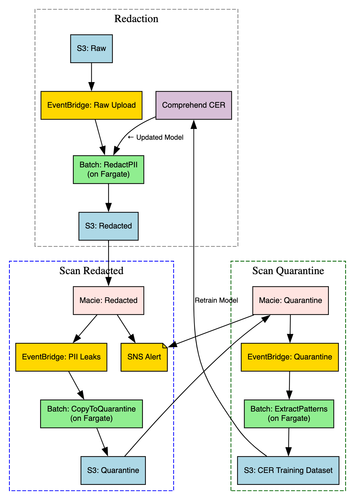

# 🛡️ PII Redaction Pipeline

This repository implements a serverless pipeline for redacting personally identifiable information (PII) from voice metadata stored as JSON in S3. It uses Amazon Comprehend, Macie, and EventBridge to ensure privacy, compliance, and continuous model improvement.

---

## System Design Diagram

A detailed system design diagram shows the full data flow across:

- Raw ingestion
- Comprehend-based redaction
- Macie validation
- Feedback loop and CER retraining

  

The architecture is designed to process high-volume voice metadata files, redact sensitive content using Amazon Comprehend, validate using Macie, and continuously improve through feedback and retraining.

## 🔄 Data Flow Description

### 1. 📨 Raw File Ingestion

Raw JSON files containing up to 15,000 payloads each are uploaded daily to a structured S3 bucket. This triggers an EventBridge `Raw Upload` rule, which invokes a lightweight Lambda `SubmitRedactJob` responsible for submitting a Batch job `RedactPII` for redaction. This separation of concerns ensures that trigger logic remains minimal and scalable, while the heavy lifting is offloaded to the compute-efficient Batch job system

### 2. 🧼 Redaction via Batch Job using Comprehend

The redaction is performed using a Batch job `RedactPII` on AWS Fargate. It leverages a Comprehend Custom Entity Recognizer (CER) model to detect and redact PII from the sentence fields in each payload. The output is stored in a separate `S3: Redacted` bucket. Using a Batch Job allows for longer execution windows, and better performance when dealing with large files.

### 3. 🕵️ Validation with Macie

To verify redaction quality, files in `S3: Redacted` are asynchronously scanned by **Amazon Macie**, which uses ML to flag any residual PII. This creates a safety net over Comprehend and acts as an external layer of validation. Findings are routed to EventBridge `PII Leaks`, enabling downstream automation without tight coupling.

### 4. 🚨 Quarantine on Redaction Failures

When PII leaks are detected, EventBridge `PII Leaks` invokes a second Lambda `SubmitCopyJob` that submits the `CopyToQuarantine` Batch job. This job copies the original raw files (those linked to Macie-detected leaks) to a separate quarantine bucket. Using Batch here ensures the system can handle copying large numbers of files at once without running into Lambda limitations.

### 5. 🧪 Scan Quarantined Files with Macie

To extract patterns of missed PII, **Macie** scans the raw files in `S3: Quarantine`. These results — published to EventBridge `Quarantine` — provide valuable detail about redaction blind spots and failure causes, setting the stage for retraining the redaction logic.

### 6. 🔁 Feedback Pattern Extraction

The EventBridge `Quarantine` rule triggers a final Lambda `SubmitFeedbackJob` to submit a Batch job for pattern extraction. The `ExtractPatterns` Batch job parses Macie’s findings from quarantined files, aligns them to raw input spans, and emits structured training examples to `S3: CER Training Dataset`. This builds a continuously growing dataset of edge-case PII examples, providing the raw material for a self-improving pipeline.

### 7. 🧠 Custom Entity Recognizer (CER) Retraining

**Amazon Comprehend CER** periodically retrains using the examples written to `S3: CER Training Dataset`. By learning from Macie’s real-world failure cases, the system closes the loop — improving redaction quality over time without manual rule updates.

---

## 🔐 Security Considerations

The pipeline is designed to meet privacy and compliance standards.

| Layer                       | Controls Applied                                         |
|-----------------------------|----------------------------------------------------------|
| **S3 Buckets**              | KMS encryption, block public access, fine-grained IAM    |
| **Batch Jobs**              | Scoped roles with minimum privileges                     |
| **Comprehend CER**          | Versioned deployments, isolated training roles           |
| **Macie Findings**          | Routed via EventBridge; findings optionally encrypted    |
| **SNS Notifications**       | Security team alerting on PII leak events                |
| **Quarantine Isolation**    | Files with failed redactions are segregated for review   |

---

## 🚀 Scalability Strategy

This system is event-driven, scalable, and cloud-native.

| Component                    | Scalability Characteristics                              |
|------------------------------|----------------------------------------------------------|
| **S3 Storage**               | Virtually unlimited file ingestion                       |
| **Batch Jobs**.              | Robust to spikes in file volumes and size                |
| **Comprehend**               | Fully managed service for training and inference         |
| **Macie Scans**              | Scheduled or triggered asynchronous scans                |
| **EventBridge Routing**      | Decouples logic, supports high-throughput routing        |
| **Training Data Pipeline**   | Grows incrementally and supports batch retraining        |

---

## ✅ Human-in-the-Loop Review Points

| Stage                     | Human Responsibility                                  |
| ------------------------- | ----------------------------------------------------- |
| Macie SNS Alert           | Investigate PII leak patterns                         |
| Quarantine File Review    | Label sentences for new PII patterns                  |
| CER Dataset Curation      | Review CSV/JSONL files generated by Lambda            |
| CER Training Launch       | Trigger training job (manual or automated)            |
| Model Deployment Approval | Validate updated model performance before redeploying |

